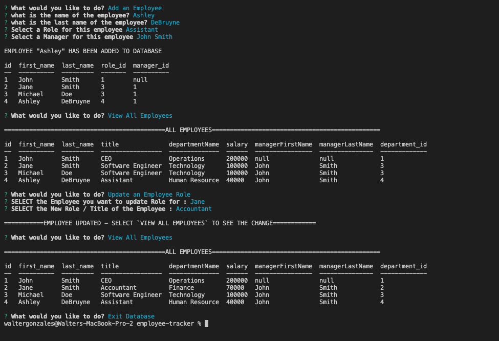
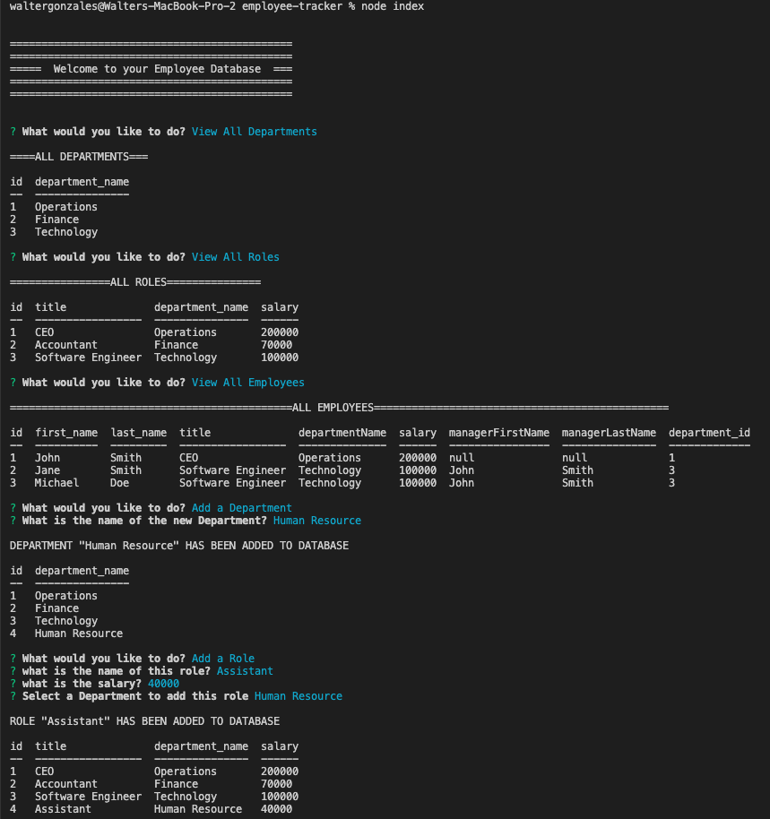

# employee-tracker


[](https://opensource.org/licenses/Artistic-2.0)

## Description
An application to save data for your company using inquirer, express and mysql. It allows you to create Departments, Roles and Employees as well as updating employees to new roles. With Console.Table, you are able to view a descriptibe table of all employees information.

[click here](sample-readme/sampleReadme.md)

## Table of Contents

* [Deployment](#deployment)
* [Demo](#demo)
* [Usage](#usage)
* [License](#license)
* [Contribution](#contribution)
* [Questions](#questions)


## Deployment

click here:

Link: 


## Demo

 "type a note"
 "add a note"
 "review a note"
 "write a new note"
 "delete a note"


## Usage

You can use this application to save information of your company
 
## License

[](https://opensource.org/licenses/MIT)


## contribution

Please send me an email if you can want to contribute or submit any suggestions: walterlaw19@gmail.com


## Questions

If you have any questions or concerns, you can reach me at: walterlaw19@gmail.com

or visit my GitHub: https://github.com/walterlaw19


```
Made by by Walter G
```

---
##### © 2021 WG.


